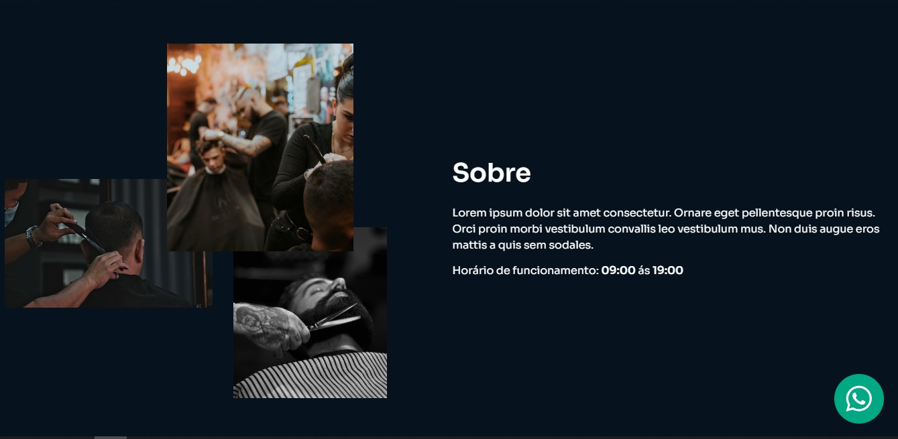
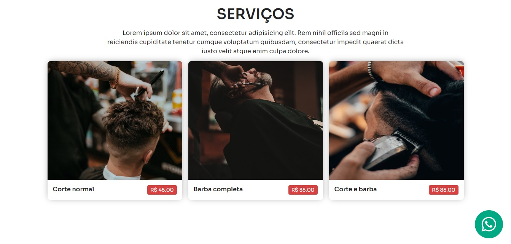

# Dev Barber - Página da Barbearia

Bem-vindo à página do projeto Dev Barber! Aqui você encontrará informações sobre a barbearia, seus serviços, localização e muito mais.

## Visão Geral

O projeto "Dev Barber" é uma representação virtual da barbearia fictícia, projetada utilizando tecnologias web modernas: HTML, CSS e SASS. Nosso objetivo é fornecer aos clientes uma experiência digital agradável e informativa sobre os serviços que oferecemos.

## Tecnologias Utilizadas

- HTML
- CSS
- SASS (Pré-processador CSS)

## Resultado

